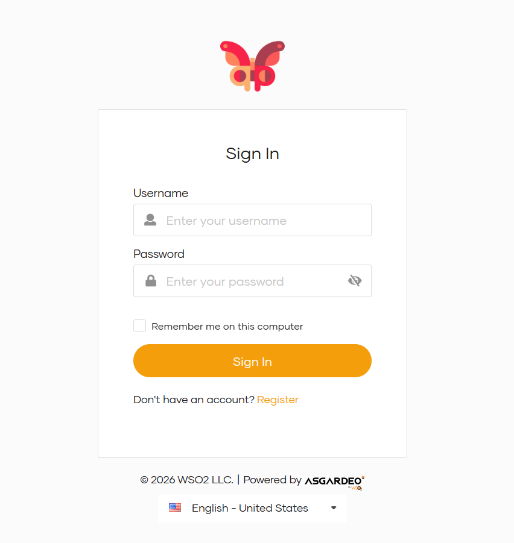
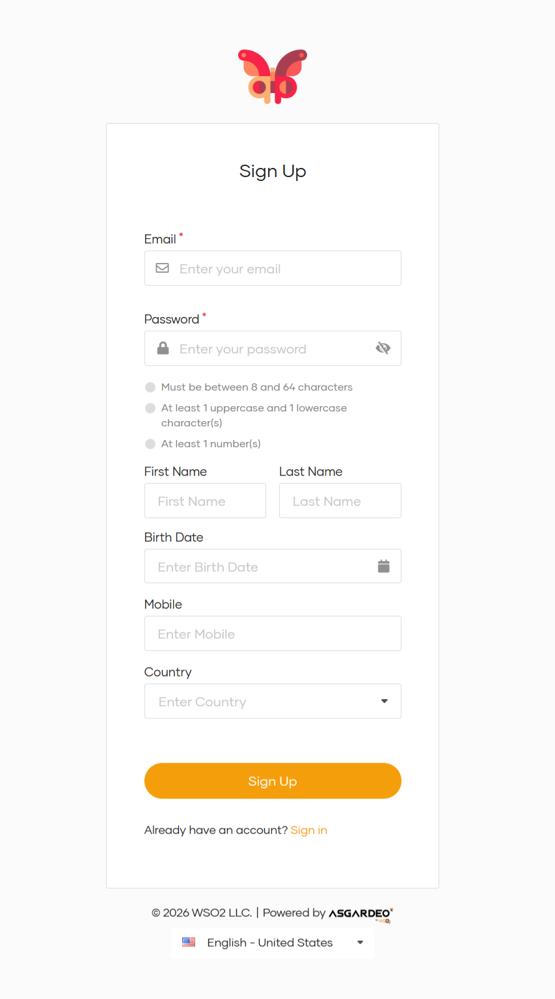
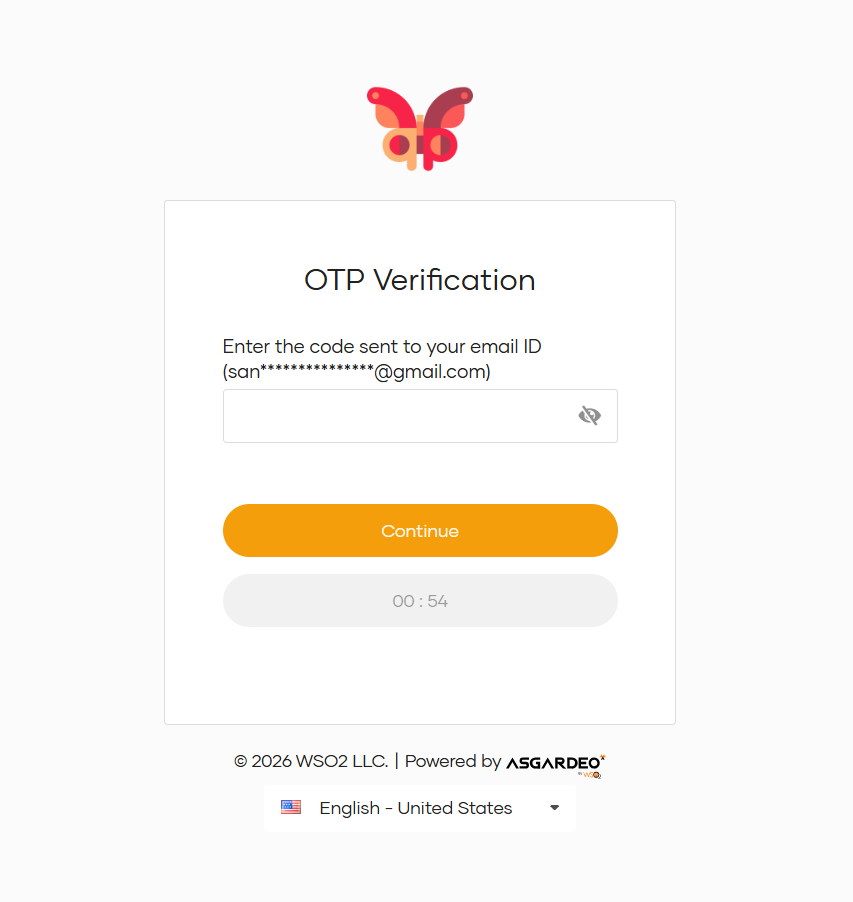

# Pizza Lab

A full-stack pizza ordering web application built with **React + TypeScript** (frontend) and **FastAPI + MongoDB** (backend), secured with **WSO2 Asgardeo** as the Identity Provider using OIDC / PKCE.

---

## Features

- **Browse the Menu** — View the full pizza catalog with images and descriptions
- **Pizza Details** — Explore individual pizza pages with sizing and customization info
- **Shopping Cart** — Add/remove items, view totals in real-time
- **Checkout** — Authenticated order placement via secure API calls
- **Order Confirmation** — Post-order success page with order summary
- **SSO / OIDC Login** — Seamless login via Asgardeo (Authorization Code + PKCE), no passwords stored in-app
- **JWT-Protected API** — Backend validates Bearer tokens using Asgardeo JWKS; supports both JWT and opaque token introspection

---

## Architecture

```
Pizza-Lab/
├── frontend/         # React 19 + TypeScript + Vite SPA
│   └── src/
│       ├── pages/    # MenuPage, PizzaDetailsPage, CartPage, CheckoutPage, etc.
│       ├── components/
│       ├── hooks/    # useCart
│       ├── services/ # Axios API client
│       ├── auth/     # OIDC context & config
│       └── types/
│
├── backend/          # FastAPI + Motor (async MongoDB)
│   └── app/
│       ├── api/      # REST controllers: catalog, cart, checkout, auth
│       ├── business/ # Business logic layer
│       ├── models/   # Pydantic models
│       ├── schemas/  # Request/response schemas
│       ├── repositories/ # MongoDB data access
│       └── core/     # Config, DB connection
│
└── docs/
    ├── auth-flow.md  # OIDC authentication flow walkthrough
    └── wso2-setup.md # Asgardeo / WSO2 IS setup guide
```

---

## Tech Stack

| Layer        | Technology                                          |
|--------------|-----------------------------------------------------|
| Frontend     | React 19, TypeScript, Vite                          |
| Routing      | React Router DOM v7                                 |
| Auth (FE)    | `react-oidc-context`, `oidc-client-ts`              |
| HTTP Client  | Axios                                               |
| Backend      | FastAPI, Uvicorn                                    |
| Database     | MongoDB (via `motor` async driver)                  |
| Auth (BE)    | PyJWT + Asgardeo JWKS / Token Introspection         |
| Identity     | WSO2 Asgardeo (OIDC, Authorization Code + PKCE)     |

---

## Prerequisites

- **Node.js** v18+ and npm
- **Python** 3.11+
- **MongoDB** running locally on port `27017` (or a cloud URI)
- An **Asgardeo** account with an OIDC Single Page Application configured

---

## Getting Started

### 1. Clone the repository

```bash
git clone https://github.com/<your-username>/Pizza-Lab.git
cd Pizza-Lab
```

---

### 2. Backend setup

```bash
cd backend

# Create and activate virtual environment
python -m venv .venv
.venv\Scripts\activate       # Windows
# source .venv/bin/activate  # macOS/Linux

# Install dependencies
pip install -r requirements.txt

# Configure environment
copy .env.example .env       # Windows
# cp .env.example .env       # macOS/Linux
```

Edit `backend/.env`:

```env
APP_NAME=Pizza Lab API
APP_ENV=development
BACKEND_PORT=8000
FRONTEND_ORIGIN=http://localhost:5173
MONGO_URI=mongodb://localhost:27017
MONGO_DB=pizza_lab

WSO2_ISSUER=https://api.asgardeo.io/t/<your-org>/oauth2/token
WSO2_JWKS_URL=https://api.asgardeo.io/t/<your-org>/oauth2/jwks
WSO2_AUDIENCE=<your-asgardeo-client-id>
WSO2_VERIFY_TLS=true

# Only needed if Asgardeo issues opaque (non-JWT) access tokens:
ASGARDEO_INTROSPECT_CLIENT_ID=
ASGARDEO_INTROSPECT_CLIENT_SECRET=
```

Start the API server:

```bash
uvicorn app.main:app --reload --port 8000
```

API will be available at `http://localhost:8000` — interactive docs at `http://localhost:8000/docs`.

---

### 3. Frontend setup

```bash
cd frontend

# Install dependencies
npm install

# Configure environment
copy .env.example .env       # Windows
# cp .env.example .env       # macOS/Linux
```

Edit `frontend/.env`:

```env
VITE_API_BASE_URL=http://localhost:8000/api
VITE_ASGARDEO_ORG=<your-org>
VITE_WSO2_CLIENT_ID=<your-asgardeo-client-id>
VITE_WSO2_REDIRECT_URI=http://localhost:5173/auth/callback
VITE_WSO2_POST_LOGOUT_REDIRECT_URI=http://localhost:5173
```

Start the dev server:

```bash
npm run dev
```

App will be available at `http://localhost:5173`.

---

## Asgardeo / WSO2 Identity Setup

> See [`docs/wso2-setup.md`](docs/wso2-setup.md) for the full configuration guide.

**Quick summary:**

1. Sign in to the [Asgardeo Console](https://console.asgardeo.io/) and create a **Single Page Application**.
2. Set **Authorized Redirect URI** → `http://localhost:5173/auth/callback`
3. Set **Allowed Origins** → `http://localhost:5173`
4. Copy the **Client ID** into both `frontend/.env` and `backend/.env`.
5. Optionally configure the app to issue **JWT access tokens** to avoid introspection.






---

## Authentication Flow

> See [`docs/auth-flow.md`](docs/auth-flow.md) for a detailed walkthrough.

```
User clicks Login
      ↓
React app initiates OIDC Authorization Code + PKCE flow via react-oidc-context
      ↓
Asgardeo authenticates user → redirects to /auth/callback?code=...
      ↓
oidc-client-ts exchanges code for access_token (stored in sessionStorage)
      ↓
API calls include: Authorization: Bearer <access_token>
      ↓
FastAPI validates token via Asgardeo JWKS (iss, aud, signature)
      ↓
Backend extracts sub as user_id → executes cart / checkout logic
```

---

## API Endpoints

| Method | Endpoint              | Auth Required | Description              |
|--------|-----------------------|:-------------:|--------------------------|
| GET    | `/health`             | ❌            | Health check              |
| GET    | `/api/catalog`        | ❌            | List all pizzas           |
| GET    | `/api/catalog/{id}`   | ❌            | Get a single pizza        |
| GET    | `/api/auth/me`        | ✅            | Current user info         |
| GET    | `/api/cart`           | ✅            | Get user's cart           |
| POST   | `/api/cart`           | ✅            | Add item to cart          |
| DELETE | `/api/cart/{item_id}` | ✅            | Remove item from cart     |
| POST   | `/api/checkout`       | ✅            | Place an order            |

---

## Running Tests

**Frontend:**

```bash
cd frontend
npm run test
```

**Backend:**

```bash
cd backend
pytest
```

---

## Environment Variables Reference

### `frontend/.env`

| Variable                          | Description                              |
|-----------------------------------|------------------------------------------|
| `VITE_API_BASE_URL`               | Backend API base URL                     |
| `VITE_ASGARDEO_ORG`               | Your Asgardeo organization name          |
| `VITE_WSO2_CLIENT_ID`             | Asgardeo application Client ID           |
| `VITE_WSO2_REDIRECT_URI`          | OIDC callback URL                        |
| `VITE_WSO2_POST_LOGOUT_REDIRECT_URI` | Post-logout redirect URL              |

### `backend/.env`

| Variable                          | Description                              |
|-----------------------------------|------------------------------------------|
| `MONGO_URI`                       | MongoDB connection string                |
| `MONGO_DB`                        | Database name (`pizza_lab`)              |
| `FRONTEND_ORIGIN`                 | Allowed CORS origin                      |
| `WSO2_ISSUER`                     | Asgardeo token issuer URL                |
| `WSO2_JWKS_URL`                   | Asgardeo JWKS endpoint                   |
| `WSO2_AUDIENCE`                   | Expected `aud` claim (your Client ID)    |
| `WSO2_VERIFY_TLS`                 | Verify TLS on JWKS requests (`true`)     |
| `ASGARDEO_INTROSPECT_CLIENT_ID`   | Client ID for opaque token introspection |
| `ASGARDEO_INTROSPECT_CLIENT_SECRET` | Client secret for introspection        |

---

## License

This project is for educational purposes. Feel free to fork and extend it.
